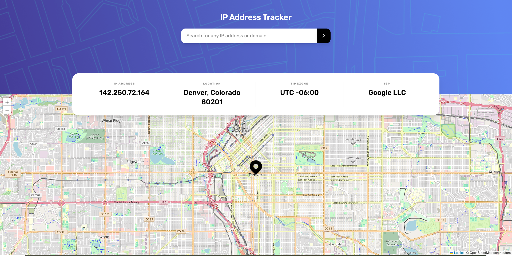

# Frontend Mentor - IP Address Tracker Solution

This is a solution to the [IP Address Tracker challenge on Frontend Mentor](https://www.frontendmentor.io/challenges/ip-address-tracker-I8-0yYAH0). Frontend Mentor challenges help you improve your coding skills by building realistic projects.

## Table of contents

- [Overview](#overview)
  - [The challenge](#the-challenge)
  - [Screenshot](#screenshot)
  - [Links](#links)

- [My process](#my-process)
  - [Built with](#built-with)
  - [What I learned](#what-i-learned)
  - [Continued development](#continued-development)
  - [Useful resources](#useful-resources)

- [Author](#author)

## Overview

### The challenge

Users should be able to:

- View the optimal layout for each page depending on their device's screen size
- See hover states for all interactive elements on the page
- See their own IP address on the map on the initial page load
- Search for any IP address or domain and see the key information and location

### Screenshot



### Links

- Solution URL: [GitHub Repo](https://github.com/citisolo/ip-address-tracker-app)
- Live Site URL: [Netlify Deployment](https://citisolo-ip-address-tracker.netlify.app/)

## My process

### Built with

- Semantic HTML5 markup
- Tailwind CSS utility classes
- Mobile-first responsive design
- [React Router v7](https://reactrouter.com/) - for routing
- [React](https://reactjs.org/) - UI library
- [TypeScript](https://www.typescriptlang.org/) - for type safety
- [Leaflet](https://leafletjs.com/) - for interactive maps
- [Netlify Functions](https://docs.netlify.com/functions/overview/) - for API proxy and secure key management

### What I learned

- How to integrate **React Router v7** with client loaders to manage search queries via URL (`?q=`) and hydrate state.
- Practical use of **Netlify Functions** to secure API keys and avoid exposing them to the client.
- Handling **CORS** and environment variables in local vs production builds.
- Tailwind component extraction for a more scalable design system (e.g., `.hero`, `.card`, `.input`).

Example: syncing form state with query params

```tsx
useEffect(() => {
  const q = new URLSearchParams(search).get("q") ?? "";
  setValue(q);
}, [search]);
```

### Continued development

- Improve accessibility by adding ARIA roles and testing with screen readers.
- Add a **dark mode toggle** instead of relying only on system preference.
- Replace Leaflet with a static map fallback for **No-JS support**.
- Expand API error handling to cover rate limits and invalid queries more gracefully.
- Add an SSR mode option to keep API secrets server-side: move lookups into route loaders/actions and remove VITE\_\* keys from the client bundle; document SSR vs SPA trade-offs.

### Useful resources

- [React Router v7 Docs](https://reactrouter.com/) - Helped with setting up loaders and navigation.
- [Leaflet Quick Start](https://leafletjs.com/examples/quick-start/) - Great intro to configuring a basic interactive map.
- [Netlify Dev Docs](https://docs.netlify.com/cli/get-started/) - Explained how to proxy functions locally.
- [Tailwind CSS Docs](https://tailwindcss.com/docs) - For learning how to extract utility classes into reusable components.

## Setup / Installation

1. Clone the repository:

   ```bash
   git clone https://github.com/citisolo/ip-address-tracker-app.git
   cd ip-address-tracker-app
   ```

2. Install dependencies:

   ```bash
   npm install
   ```

3. Start the dev server:

   ```bash
   npm run dev
   ```

4. Open [http://localhost:5173](http://localhost:5173) in your browser.

## Author

- GitHub - [citisolo](https://github.com/citisolo)
- Frontend Mentor - [@citisolo](https://www.frontendmentor.io/profile/citisolo)
